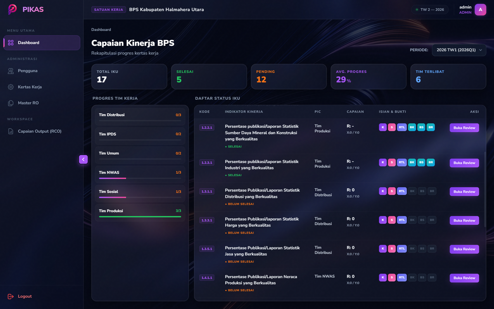
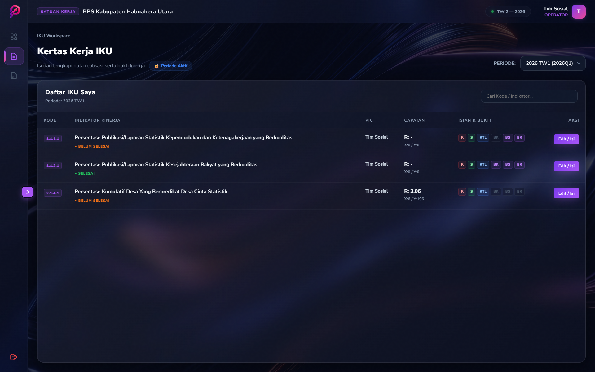
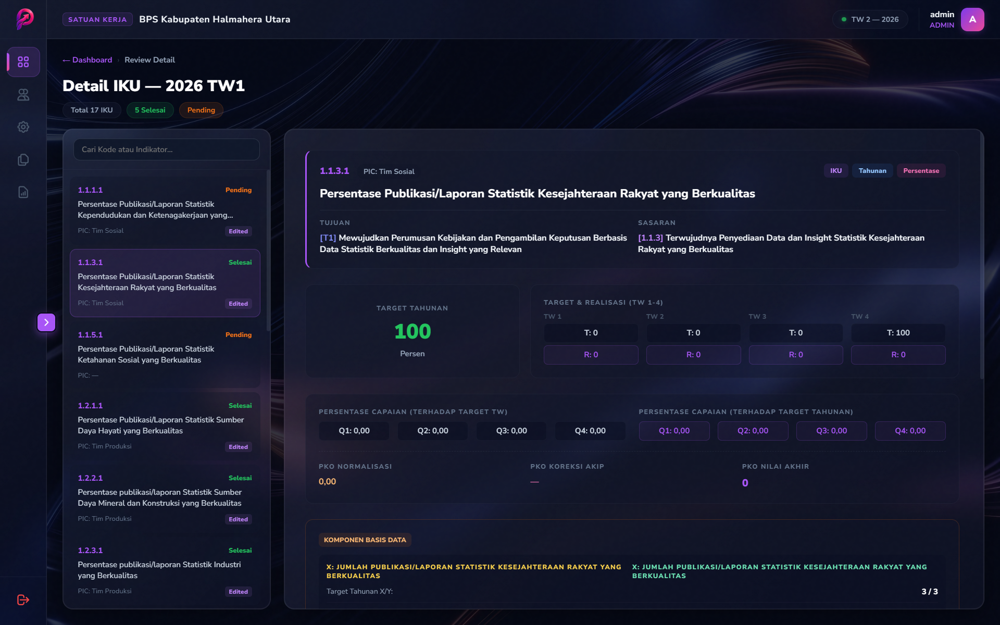
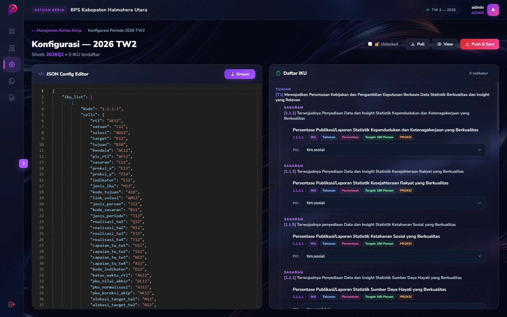

<div align="center">


# PIKAS
### *Performance Indicators Knowledgebase Accountability System*

Sistem manajemen kinerja terintegrasi berbasis web untuk monitoring IKU, pengisian kertas kerja, dan pelaporan Realisasi Capaian Output (RCO) secara efisien dan akurat.

[](https://python.org)
[](https://djangoproject.com)
[](./LICENSE)
[]()

</div>

---

## Latar Belakang

Proses pelaporan kinerja di lingkungan instansi pemerintah seringkali tersebar di berbagai platform — spreadsheet, email, folder drive — sehingga mempersulit koordinasi, validasi, dan pelaporan tepat waktu. **PIKAS** hadir sebagai solusi terpadu yang menyatukan seluruh alur kerja pelaporan kinerja dalam satu antarmuka yang modern, aman, dan dapat diaudit.

## 🖼️ Preview Aplikasi

Berikut adalah gambaran antarmuka PIKAS yang modern dan intuitif:

<div align="center">
  <table>
    <tr>
      <td width="50%">
        <p align="center"><b>Dashboard Monitoring</b></p>
        
      </td>
      <td width="50%">
        <p align="center"><b>Workspace Operator</b></p>
        
      </td>
    </tr>
    <tr>
      <td width="50%">
        <p align="center"><b>Review Pimpinan</b></p>
        
      </td>
      <td width="50%">
        <p align="center"><b>Manajemen RCO</b></p>
        
      </td>
    </tr>
  </table>
</div>

## ✨ Fitur Utama

| Fitur | Deskripsi |
|---|---|
| **Dashboard Real-time** | Matrix Monitor yang menampilkan progres pengisian, capaian, dan status tim secara komprehensif |
| **Kertas Kerja Digital** | Sinkronisasi dua arah (PULL/PUSH) dengan Google Sheets via Service Account |
| **Workspace Operator** | Antarmuka kerja khusus untuk pengisian realisasi, kendala, solusi, dan RTL |
| **Manajemen RCO** | Pengelolaan Master RO dengan Monaco JSON Editor dan Full-Sync Logic |
| **Capaian Output (RCO)** | Pencatatan dan monitoring realisasi dokumen capaian bulanan per RO |
| **Integrasi Google Drive** | File explorer terintegrasi untuk akses bukti kinerja tanpa meninggalkan aplikasi |
| **Sistem Review** | Alur validasi supervisor dengan audit trail yang terstruktur |
| **Manajemen Periode** | Manajemen triwulanan (TW I–IV) dengan fitur penguncian data setelah batas waktu |
| **Kontrol Akses Berbasis Peran** | Tiga level akses: Admin, Operator, dan Viewer |

## 🛠️ Teknologi

- **Backend**: Django 5.1+ (Python 3.10+)
- **Database**: PostgreSQL (Produksi) / SQLite (Pengembangan)
- **Frontend**: Vanilla JavaScript, CSS Custom Properties (Dark Mode Premium)
- **Editor JSON**: Monaco Editor (VS Code Engine) via CDN
- **Integrasi**: Google Sheets API v4, Google Drive API v3
- **Autentikasi API**: Google Service Account (OAuth2)
- **Deployment**: Gunicorn + Docker (opsional)

## 📁 Struktur Proyek

```
pikas/
├── pikas_app/
│   ├── migrations/         # Riwayat migrasi database
│   ├── services/           # Modul integrasi GSheet & GDrive
│   ├── static/             # Aset statis (CSS, JS, gambar)
│   ├── templates/          # Template HTML
│   ├── models.py           # Definisi model database
│   ├── views.py            # Logika tampilan dan API endpoint
│   └── urls.py             # Routing URL
├── pikas_project/          # Konfigurasi proyek Django
├── docs/                   # Dokumentasi teknis lengkap
│   ├── TECHNICAL_GUIDE.md
│   ├── MAPPING_GUIDE.md
│   └── SETUP_PRODUCTION.md
├── .env.example            # Template konfigurasi environment
├── mapping.json            # Contoh file mapping IKU ke GSheet (JANGAN unggah data asli)
├── requirements.txt        # Dependensi Python
├── Dockerfile              # Konfigurasi container Docker
└── manage.py
```

## 🚀 Instalasi Cepat (Pengembangan Lokal)

> Untuk panduan deployment produksi yang lengkap, lihat [docs/SETUP_PRODUCTION.md](docs/SETUP_PRODUCTION.md).

**1. Clone repositori**
```bash
git clone https://github.com/rizanto/pikas.git
cd pikas
```

**2. Buat dan aktifkan virtual environment**
```bash
python -m venv venv
# Windows
venv\Scripts\activate
# Linux / macOS
source venv/bin/activate
```

**3. Install dependensi**
```bash
pip install -r requirements.txt
```

**4. Salin dan isi konfigurasi environment**
```bash
cp .env.example .env
# Edit file .env sesuai konfigurasi lokal Anda
```

**5. Jalankan migrasi database**
```bash
python manage.py migrate
```

**6. Buat akun administrator**
```bash
python manage.py createsuperuser
```

**7. Jalankan server pengembangan**
```bash
python manage.py runserver
```

Akses aplikasi di `http://127.0.0.1:8000`

## 📚 Dokumentasi

| Dokumen | Deskripsi |
|---|---|
| [Panduan Teknis](docs/TECHNICAL_GUIDE.md) | Arsitektur sistem, alur data, dan penjelasan komponen backend |
| [Panduan Mapping](docs/MAPPING_GUIDE.md) | Cara mengisi `mapping.json` dan `ro-mapping.json` untuk integrasi GSheet |
| [Setup Produksi](docs/SETUP_PRODUCTION.md) | Panduan deployment ke VPS, konfigurasi Gunicorn, Nginx, dan SSL |

## ⚖️ Lisensi & Hak Cipta

```
Copyright (c) 2026 Ilham Rizanto. Seluruh hak cipta dilindungi.
```

Perangkat lunak ini dilindungi oleh lisensi proprietary. **Dilarang keras** menggunakan, menyalin, mendistribusikan, atau memodifikasi perangkat lunak ini tanpa izin tertulis dari pemilik hak cipta.

Lihat file [LICENSE](./LICENSE) untuk ketentuan lengkap.

---

<div align="center">
  <sub>Dibangun dengan 🔥 oleh <a href="https://github.com/rizanto">Ilham Rizanto</a></sub>
</div>
